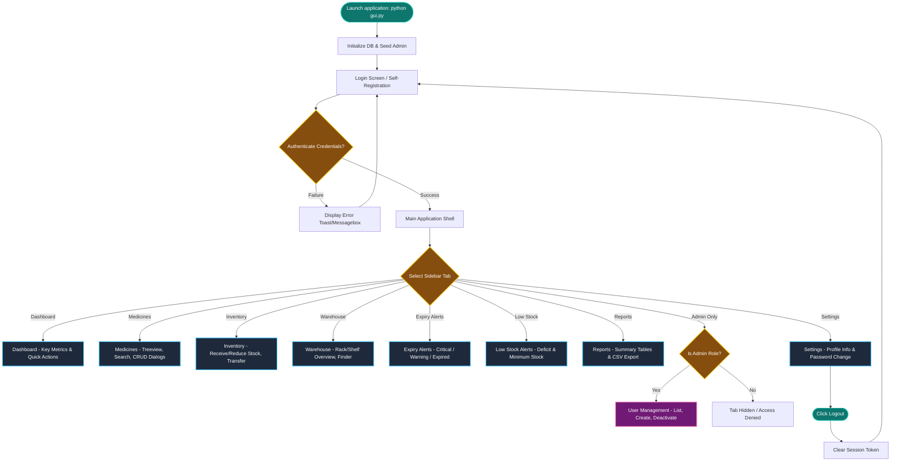
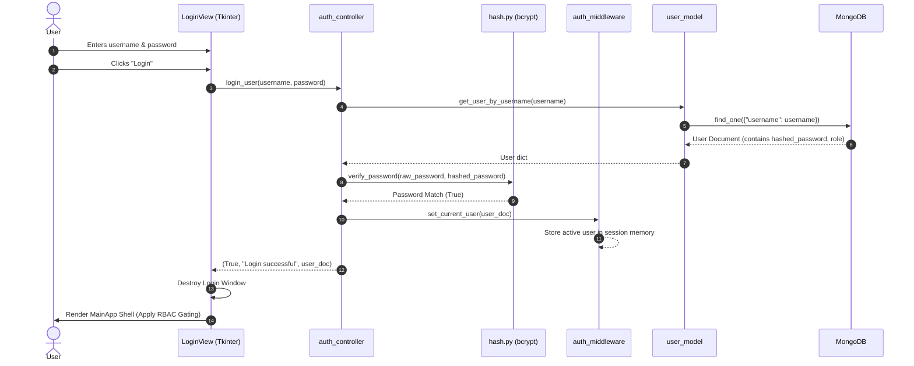
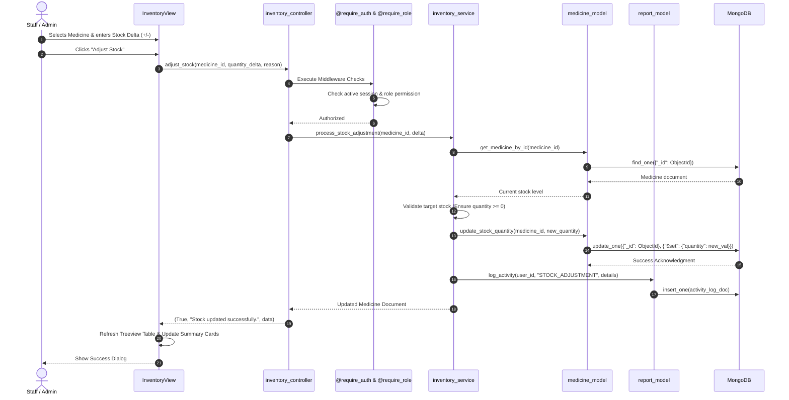
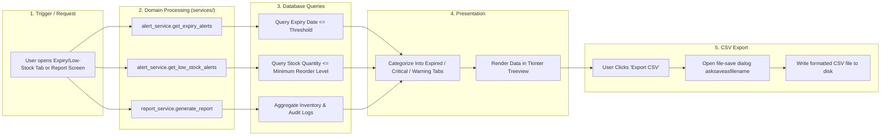

# 💊 MWIMS — Design Flow Diagrams & Gemini Prompt

This document provides complete, high-definition **Design Flow Diagrams** for the **Medicine Warehouse Inventory Management System (MWIMS)** using Mermaid.js syntax, as well as a ready-to-use **Gemini Prompt** for generating custom diagrams, visual representations, or documentation.

---

## 📐 1. System Architecture & Layered Flow

This flowchart illustrates the end-to-end multi-tier architecture, showing how user interactions flow down through Tkinter Views, Controller APIS, Middlewares, Domain Services, Data Models, and finally to MongoDB.

```mermaid
flowchart TD
    %% Styling
    classDef view fill:#161B22,stroke:#2F81F7,stroke-width:2px,color:#FFFFFF
    classDef ctrl fill:#1F2937,stroke:#3B82F6,stroke-width:2px,color:#FFFFFF
    classDef mid fill:#374151,stroke:#F59E0B,stroke-width:2px,color:#FFFFFF
    classDef svc fill:#111827,stroke:#10B981,stroke-width:2px,color:#FFFFFF
    classDef model fill:#1F2937,stroke:#EC4899,stroke-width:2px,color:#FFFFFF
    classDef db fill:#064E3B,stroke:#34D399,stroke-width:2px,color:#FFFFFF

    subgraph Presentation ["1. Presentation Layer (views/ & theme.py)"]
        UI_Login["Login & Register View"]:::view
        UI_Dash["Dashboard View"]:::view
        UI_Med["Medicine CRUD View"]:::view
        UI_Inv["Inventory & Stock View"]:::view
        UI_Wh["Warehouse Location View"]:::view
        UI_Alerts["Expiry & Low Stock Views"]:::view
        UI_Rep["Reports & Export View"]:::view
        UI_Users["User Management View (Admin)"]:::view
        UI_Set["Settings View"]:::view
    end

    subgraph Controllers ["2. Business Logic Layer (controllers/)"]
        AuthCtrl["auth_controller.py"]:::ctrl
        MedCtrl["medicine_controller.py"]:::ctrl
        InvCtrl["inventory_controller.py"]:::ctrl
        WhCtrl["warehouse_controller.py"]:::ctrl
        RepCtrl["report_controller.py"]:::ctrl
    end

    subgraph Middlewares ["3. Middleware & Security (middlewares/)"]
        ReqAuth["@require_auth Decorator"]:::mid
        ReqRole["@require_role Decorator"]:::mid
        ExcHand["@handle_exceptions Decorator"]:::mid
        SessMgr["Session Manager (_current_user)"]:::mid
    end

    subgraph Services ["4. Domain Services (services/)"]
        AlertSvc["alert_service.py"]:::svc
        InvSvc["inventory_service.py"]:::svc
        RepSvc["report_service.py"]:::svc
        SearchSvc["search_service.py"]:::svc
    end

    subgraph Models ["5. Data Access Layer (models/)"]
        UserModel["user_model.py"]:::model
        MedModel["medicine_model.py"]:::model
        InvModel["inventory_model.py"]:::model
        WhModel["warehouse_model.py"]:::model
        RepModel["report_model.py"]:::model
    end

    subgraph Database ["6. Storage Layer"]
        MongoDB[("MongoDB 6+\n(MWIMS Database)")]:::db
    end

    %% Connections
    Presentation -->|Calls Controller APIs| Controllers
    Controllers --> Middlewares
    Middlewares --> Services
    Services --> Models
    Controllers --> Models
    Models -->|PyMongo Drivers| MongoDB
```



---

## 🗺️ 2. UI Navigation & Screen Flow

This diagram outlines how users navigate between screens in MWIMS, starting from launch, through authentication, sidebar section switching, role-restricted views, and logout.



---

## 🔐 3. Authentication & Session Sequence Flow

Sequence diagram demonstrating user authentication, password hashing validation with bcrypt, session middleware binding, and role-based UI gating.



---

## 📦 4. Medicine Inventory & Stock Movement Data Flow

Sequence diagram illustrating the end-to-end data flow when a warehouse operator receives or reduces medicine stock.



---

## 🚨 5. Alert System & CSV Export Flow

Flowchart showing how real-time expiry and low-stock alerts are generated and exported.



---

## 🤖 6. Gemini Prompt (Ready to Copy-Paste)

If you need Gemini to generate **visual architecture diagrams**, **presentation slide outlines**, **UI design mockups**, or **technical documentation**, copy and paste the prompt below into Gemini:

```text
You are an expert Software Architect and UI/UX Designer specializing in Python desktop applications and MongoDB database architectures.

I need you to analyze and generate comprehensive design flows and architectural diagrams for MWIMS (Medicine Warehouse Inventory Management System), a desktop application built with Python 3.13+, Tkinter, PyMongo, and MongoDB.

### Project Context & Specifications:
1. Architecture Pattern: Clean MVC Architecture (Views -> Controllers -> Services/Middlewares -> Data Models -> MongoDB).
2. Key User Roles: Admin (Full Access + User Mgmt), Staff (Inventory CRUD & Adjustments), Auditor (Read-Only & CSV Export).
3. Primary Modules:
   - Presentation Layer: Tkinter Views (`login_view.py`, `main_app.py`, `medicine_view.py`, `inventory_view.py`, `warehouse_view.py`, `expiry_view.py`, `low_stock_view.py`, `reports_view.py`, `user_management_view.py`, `settings_view.py`) with a centralized design system in `theme.py`.
   - Business Controllers: `auth_controller`, `medicine_controller`, `inventory_controller`, `warehouse_controller`, `report_controller`.
   - Security & Decorators: `@require_auth`, `@require_role`, `@handle_exceptions`, bcrypt password hashing, session management in memory.
   - Domain Services: `alert_service` (Expiry & Low stock thresholds), `inventory_service` (Stock deltas & transfers), `report_service` (Data aggregation), `search_service` (Filtering & indexing).
   - Data Models: PyMongo wrappers over MongoDB collections (`users`, `medicines`, `inventory_logs`, `warehouses`, `activity_logs`).

### What I need you to generate:
1. Detailed Technical Breakdown: Explain the exact data flow for a multi-step inventory operation (e.g., Medicine Transfer between warehouse locations).
2. Mermaid Diagrams:
   - Component & Layer Architecture Diagram.
   - User Role Access Control Matrix Flowchart.
   - Sequence Diagram for Report Generation and CSV Export.
3. Recommendations for Improvement: Suggest 3-5 architectural enhancements (e.g., adding caching, asynchronous database calls, or audit log encryption) tailored specifically to Python Tkinter + MongoDB setups.

Please format the response cleanly with Markdown formatting, headings, code blocks, and Mermaid diagrams.
```
